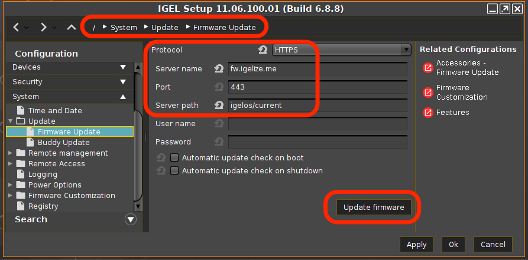

# HOWTO Collect Hardware Information for a Device

-----

## Steps to collect the data

- Format a USB thumb drive on your PC (FAT or NTFS)
- Copy the collection script (see below) to USB thumb drive
- Enable Storage Hotplug (Devices > Storage Devices > Storage Hotplug)
- Plug USB thumb drive in IGEL OS device (auto mounted in /media folder)
- Open terminal window (as Root)
- Run collection script
- Safely remove USB thumb drive (Start > System > Safely Remove Hardware)
- Send zip file to your contact

-----

## Collection Script

Collection script (collect_data.sh) to copy onto thumb drive

```
#!/bin/bash

mkdir data_dump
cd data_dump

lshw > lshw_ouptut.txt
lsusb > lsusb_output.txt
lspci > lspci_output.txt
dmesg > dmesg_output.txt
alsa-info --no-upload --output alsa-infor_output.txt
rfkill list all > rfkill_list_all.txt
journalctl > journalctl_output.txt
cp /var/log/Xorg.0.log Xorg.0.log
cp /etc/os-release etc-os-release.txt
cp /wfs/group.ini wfs-group.ini
tar cvjf var-log.tar.bz2 /var/log

# uncomment following line for VMware Horizon
#tar cvjf vmware-user-logs.tar.bz2 /tmp/vmware-user

# uncomment following line if using Imprivata
#/services/imprivata/bin/fetch_support_info imprivata_logs_$(date +%y%m%d%H%M).zip

cd ..

zip -r data_dump.zip data_dump
   ```

-----

## Enable Storage Hotplug (Devices > Storage Devices > Storage Hotplug)


-----

## Run Collection Script (Open Terminal Window)

```
login as "user" or "root": root
 # df -H | grep media
 /dev/sda1    17G   44M     17G   1%  /media/B2B0AB93
 # cd /media/B2B0AB93
 # ls
 collect_data.sh
 # /bin/bash collect_data.sh
 # ls
 collect_data.sh
 data_dump
 data_dump.zip
 # exit
  ```

-----

## Safely remove USB thumb drive (Start > System > Safely Remove Hardware)


-----

## Tips for prepping PC for IGEL OS install

- Make sure BIOS is at latest version. Check [Linux Vendor Firmware Service (LVFS)](https://fwupd.org/lvfs/docs/users). Until IGEL OS supports LVFS, BIOS can be updated from Ubuntu 18.04. If the PC is not in LVFS, check for latest BIOS from vendor web site.
- Make sure BIOS is set back to default settings.
- Check for and apply BIOS settings for Ubuntu 18.04.

-----

## Video driver and booting (blacklist framebuffer driver)

Framebuffer drivers are generally buggy and poorly-supported, and cause suspend failures, kernel panics and general mayhem.  For this reason we never load them automatically.

If PC firmware has a Legacy Boot option, it might interfere with the kernel’s ability to use the framebuffer during boot.

The kernel may hang on framebuffer driver. As first step in debugging, blacklist the framebuffer driver in file /etc/modprobe.d/blacklist-framebuffer.conf

 For example, add the following entry to the System/Firmware Customization/Custom Commands/Base Initialization section of IGEL Setup:

echo “blacklist efifb” >> /etc/modprobe.d/blacklist-framebuffer.conf

Save the change and reboot without the “Force VESA driver” option being set.


[IGEL OS Boot Menu Explained – Video](https://videos.igelcommunity.com/igel-os-boot-menu-explained-video/)

-----

## Access terminal console, terminal log screen, or setup

- Access to terminal console: \<Ctl>\<Alt>\<F12>
- Switch back to GUI: \<Ctl>\<Alt>\<F1>
- Access terminal log screen: \<Ctl>\<Alt>\<F10>
- Access IGEL setup: \<Ctl>\<Alt>s

-----

## Extended Logging With Syslog, Tcpdump and Netlog

The IGEL Linux Registry offers a number of extended logging options that can help customers, Support and PreSales debug system and network issues.

https://kb.igel.com/igellinux/en/extended-logging-with-syslog-tcpdump-and-netlog-4237474.html

-----

## Steps to update firmware from USB drive

- [Download OS11 -> Firmware Updates -> lxos_[VERSION]_public.zip](https://www.igel.com/software-downloads/workspace-edition/)
- Format USB Drive on PC (FAT)
- Unzip lxos_[VERSION]_public.zip to USB drive
- Configure IGEL OS to take new firmware from USB drive
- Run update

```
1. Configure at least one hotplug USB device:
   setparam devices.hotplug.usb-storage.numdevices 1
2. Apply your changes:
   kill_postsetupd
3. Connect the USB storage device to the device.
4. Wait for the USB storage device to be mounted automatically.
5. Determine the mount point:
   ls /media/
6. Configure the update parameters:
   setparam update.protocol file
   setparam update.file.path /media/<name of USB storage device>
7. Start the update process in the / directory using the command update
   update
   ```

Sample script:

  ```
#!/bin/bash

setparam devices.hotplug.usb-storage.numdevices 1
kill_postsetupd
sleep 5
setparam update.protocol file
# next command only works if one device is mounted into /media
setparam update.file.path /media/$(ls /media)
update
  ```

-----

## Updating to IGEL OS - Current Version

Configure Firmware Update settings with the following parameters and then select "Update firmware":

| Parameter | Setting | Comment |
|-----------|---------|---------|
| Protocol | https | |
| Server name | fw.igelize.me | North America |
| Server name | fwemea.igelize.me | Western Europe |
| Port | 443 | |
| Server path | igelos/current | |



Sample script:

 ```
#!/bin/bash

# Updating to IGEL OS - Current Version

# Configure the update server
setparam update.protocol https

# North America
setparam update.https.server fw.igelize.me

# Western Europe
#setparam update.https.server fwemea.igelize.me

setparam update.https.port 443
setparam update.https.path igelos/current

#Start the update process
update
   ```

### North America fw.igelize.me server layout

| The layout path structure: |
|----------------------------|
| igelos/amd64 |
| igelos/arm64 |
| igelos/current |

| Under the igelos/amd64 and igelos/arm64 paths, the subpaths for the various versions of IGEL OS public and private. |
|-----------------------|
| igelos/amd64/11.06.100 |
| igelos/amd64/11.06.102 |
| igelos/arm64/11.01.120 |
