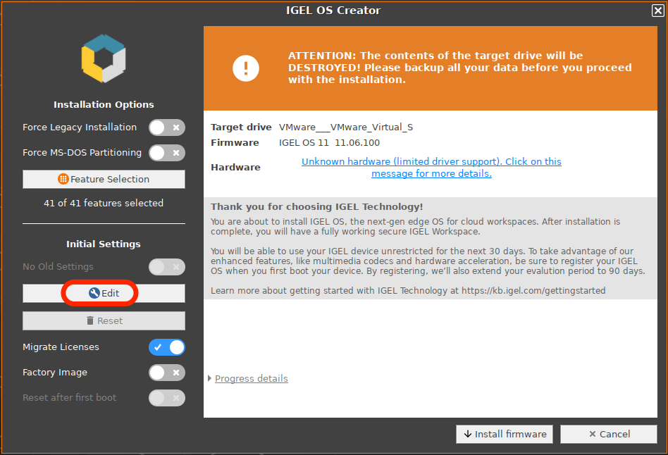
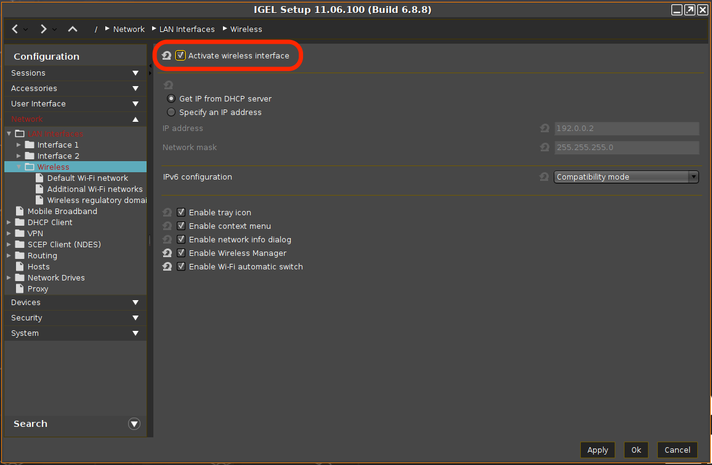

# HOWTO Edit Initial Settings Prior to OSC Install

-----

## Steps to edit initial settings prior to OSC install

- Boot OSC installer
- Select "Edit" under "Initial Settings"
- Make changes, apply, and select "Ok"

-----

## Edit Initial Settings

-----

## Activate wireless interface

