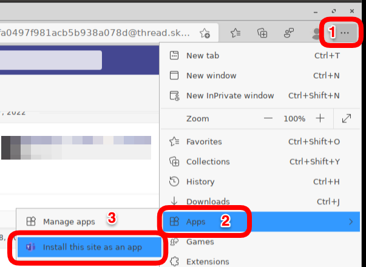
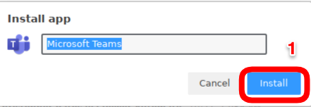
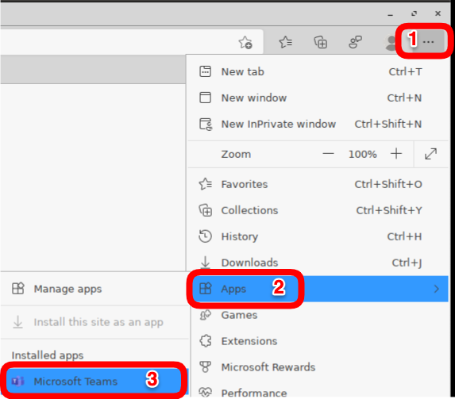

# HOWTO Microsoft Teams

# [IGEL OS UCC Configuration Guide](http://files.igelcommunity.com/igelos_ucc_guide.pdf)
-----

## How to Check communication to the Microsoft API URLs and IPs?

If Microsoft Teams is not running in optimized mode, then check that the IGEL endpoint can communicate with the Microsoft API URLs and IPs?

Run the following script in a local terminal window on IGEL endpoint:

```bash
#!/bin/bash

nc -u -v -z 13.107.64.21 3478-3481
nc -u -v -z 52.112.0.31 3478-3481
nc -u -v -z 52.120.0.41 3478-3481
nc -v -z teams.microsoft.com 80
nc -v -z teams.microsoft.com 443
nc -v -z compass-ssl.microsoft.com 443
nc -v -z mlccdnprod.azureedge.net 443
nc -v -z aka.ms 443
  ```

-----  

## Microsoft Teams progressive web app (PWA) via Edge

The PWA provides the latest Microsoft Teams features via a native IGEL client.

The PWA offers access to more capabilities, including custom backgrounds, gallery view, reactions, the raise-a-hand feature in meetings, large gallery and Together mode views, etc..

Steps to install the PWA into Microsoft Edge:

- Deploy Microsoft Edge Browser custom partition. **Note:** Increase the CP partition size by 500MB - [Microsoft Edge CP](https://github.com/IGEL-Community/IGEL-Custom-Partitions/tree/master/CP_Source/Browsers/Microsoft_Edge_stable)
- Start up Microsoft Teams in the browser - [Microsoft Teams Login](https://teams.microsoft.com)
- In the upper right hand corner of Edge, Select `...` (Settings and more (Alt+F))
- Select `Apps > Install this site as an app`




- Run the installed Microsoft Teams PWA



- Manage installed PWA applications `edge://apps`


-----

**NOTE:** Once Teams PWA application is installed, then the following shortcut can be created:


- Command Line (cmdline):

```
microsoft-edge-stable --profile-directory=Default --app-id=cifhbcnohmdccbgoicgdjpfamggdegmo "--app-url=https://teams.microsoft.com/?clientType=pwa"
  ```

- icon:

```
/custom/edge_stable/userhome/.config/microsoft-edge-stable/Default/Web Applications/Manifest Resources/cifhbcnohmdccbgoicgdjpfamggdegmo/Icons/256.png
  ```
