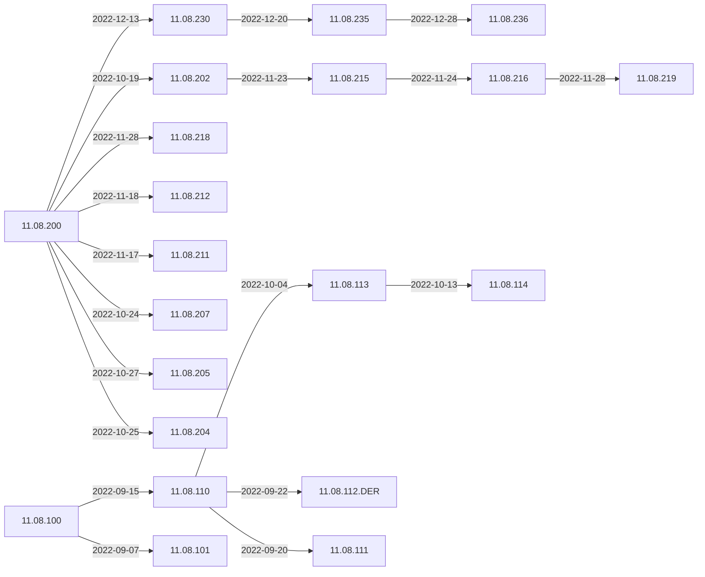
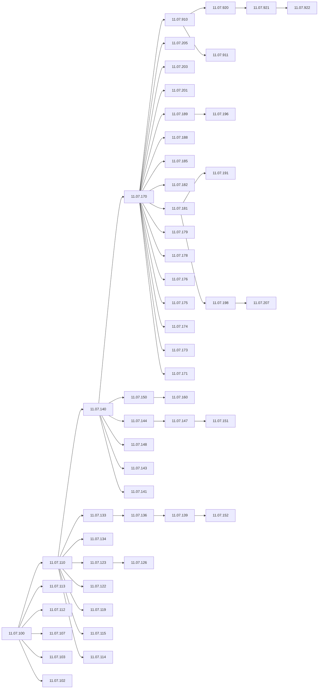
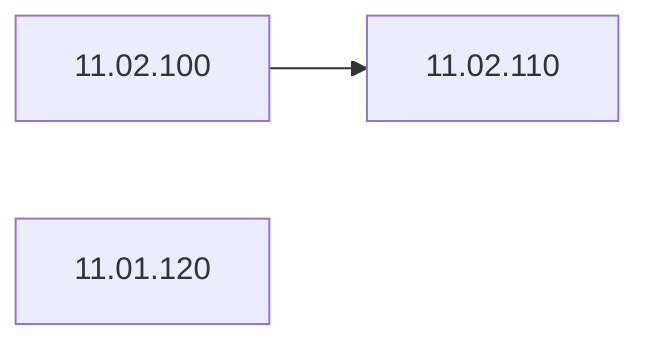

# IGEL OS Branches

Shows the brances of IGEL OS.

----

## IGEL OS 11.08

```mermaid
flowchart LR
    11.08.200-- 2022-12-13 -->11.08.230-- 2022-12-20 -->11.08.235-- 2022-12-28 -->11.08.236
    11.08.200-- 2022-10-19 -->11.08.202-- 2022-11-23 -->11.08.215-- 2022-11-24 -->11.08.216-- 2022-11-28 -->11.08.219
    11.08.200-- 2022-11-28 -->11.08.218
    11.08.200-- 2022-11-18 -->11.08.212
    11.08.200-- 2022-11-17 -->11.08.211
    11.08.200-- 2022-10-24 -->11.08.207
    11.08.200-- 2022-10-27 -->11.08.205
    11.08.200-- 2022-10-25 -->11.08.204
    11.08.110-- 2022-10-04 -->11.08.113-- 2022-10-13 -->11.08.114
    11.08.110-- 2022-09-22 -->11.08.112.DER
    11.08.100-- 2022-09-15 -->11.08.110-- 2022-09-20 -->11.08.111
    11.08.100-- 2022-09-07 -->11.08.101
    click 11.08.236 "https://github.com/IGEL-Community/IGEL-Docs/blob/main/Docs/ReleaseNotes/01-OS11/readme11.08.236.txt" "Open this in a new tab"
```

----

## IGEL OS 11.07

```mermaid
flowchart LR
  11.07.100-->11.07.110-->11.07.140-->11.07.170-->11.07.910-->11.07.920-->11.07.921-->11.07.922
  11.07.910-->11.07.911
  11.07.181-->11.07.191
  11.07.170-->11.07.205
  11.07.170-->11.07.203
  11.07.170-->11.07.201
  11.07.170-->11.07.189-->11.07.196
  11.07.170-->11.07.188
  11.07.170-->11.07.185
  11.07.170-->11.07.182
  11.07.170-->11.07.181-->11.07.198-->11.07.207
  11.07.170-->11.07.179
  11.07.170-->11.07.178
  11.07.170-->11.07.176
  11.07.170-->11.07.175
  11.07.170-->11.07.174
  11.07.170-->11.07.173
  11.07.170-->11.07.171
  11.07.140-->11.07.150-->11.07.160
  11.07.110-->11.07.133-->11.07.136-->11.07.139-->11.07.152
  11.07.140-->11.07.144-->11.07.147-->11.07.151
  11.07.140-->11.07.148
  11.07.140-->11.07.143
  11.07.140-->11.07.141
  11.07.110-->11.07.134
  11.07.110-->11.07.123-->11.07.126
  11.07.110-->11.07.122
  11.07.110-->11.07.119
  11.07.110-->11.07.115
  11.07.110-->11.07.114
  11.07.100-->11.07.113
  11.07.100-->11.07.112
  11.07.100-->11.07.107
  11.07.100-->11.07.103
  11.07.100-->11.07.102
```

----

## IGEL OS(RPI4)  

```mermaid
flowchart LR
  11.02.100-->11.02.110
  11.01.120
```
